# YTProgress

A simple Android app where you can paste any YouTube playlist link and instantly load the entire playlist. View all videos, mark videos as completed, and keep automatic track of how many videos you've finished watching.

## 🚀 Features

* **Paste YouTube Playlist Link** – Just paste the playlist URL and the entire playlist appears.
* **Mark as Done** – Keep track of the videos you've finished.
* **Notes Section** – Write and save notes for individual videos.
* **Revise Option** – Mark videos you want to revise later.
* **Pin Videos** – Pin your important videos so they stay on top.

## 📱 Screenshots

<!-- App Screenshots -->

  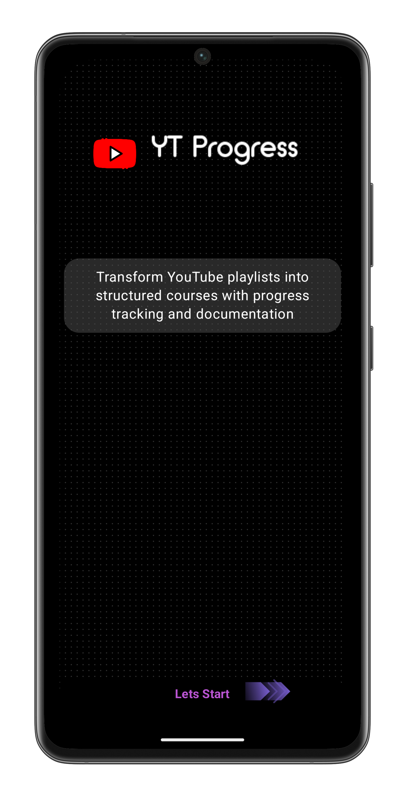
  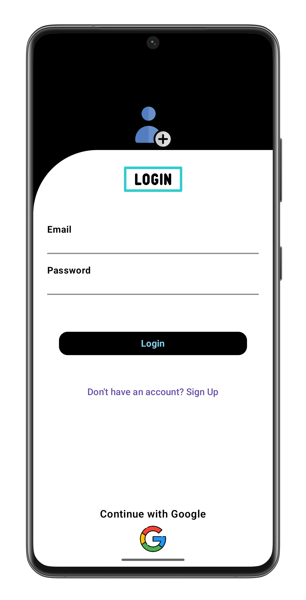
  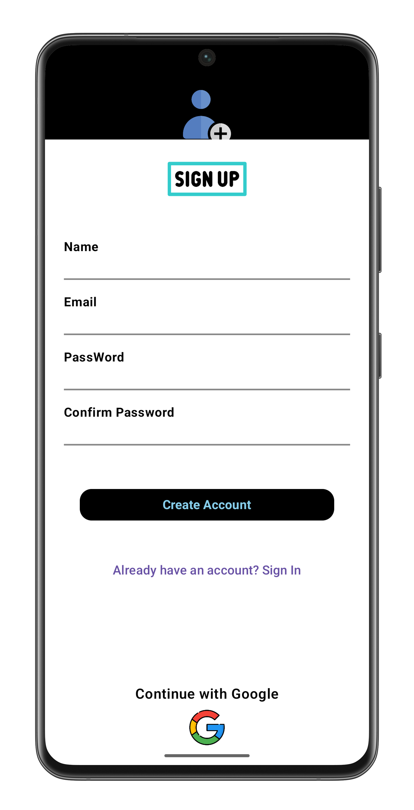
  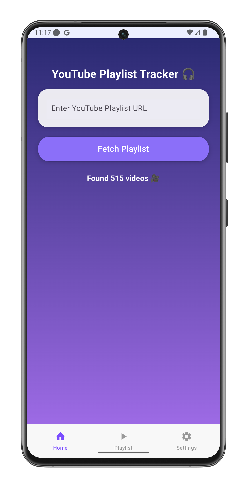

  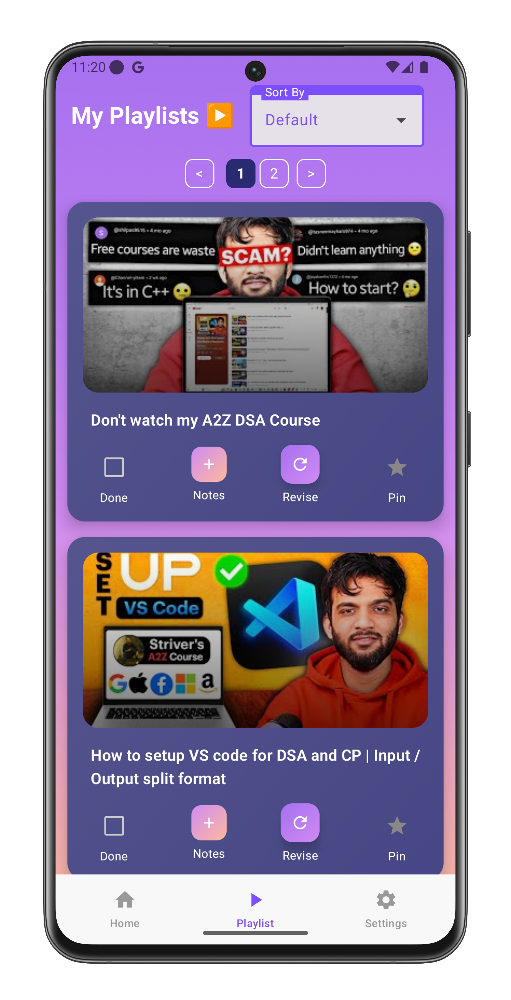
  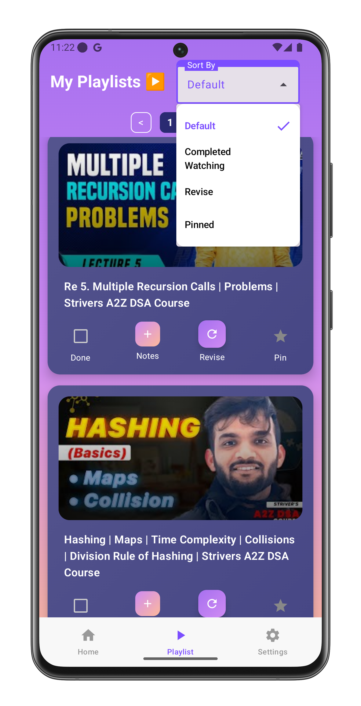
  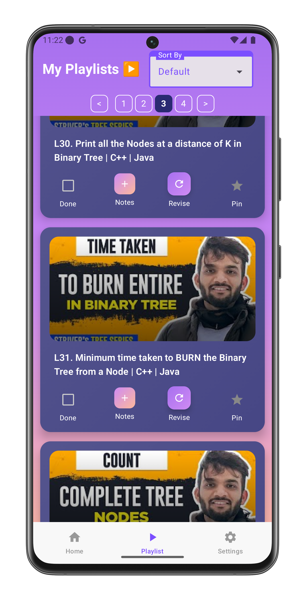
  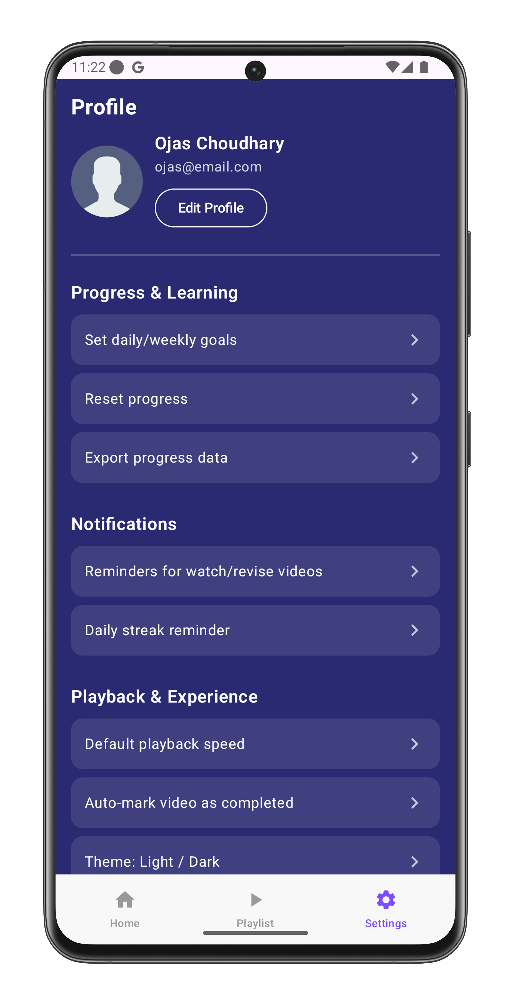

  
  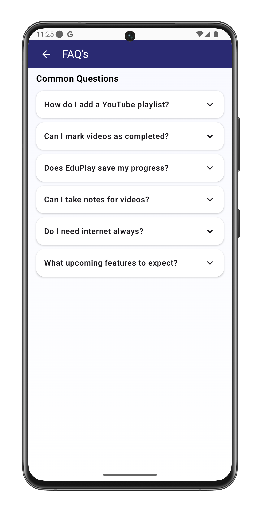
  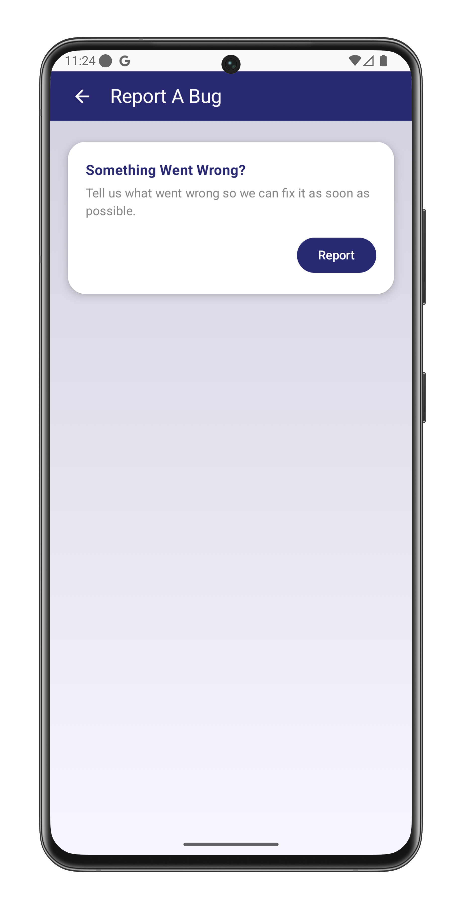
  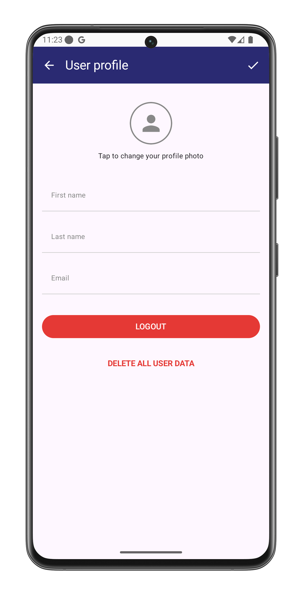

  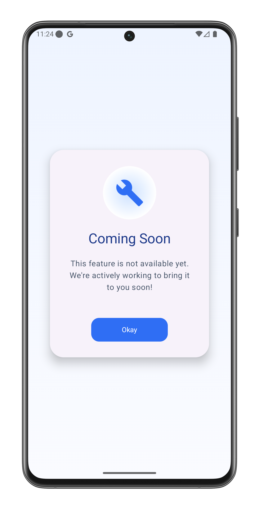

 

*(Screenshots taken on Samsung Galaxy S21 Ultra)*

## ⚠️ App Status

This app is **not yet fully completed**. More features and improvements are coming soon.

## 🛠️ Tech Stack

* **Kotlin**
* **Jetpack Compose**
* **MVVM Architecture**
* **Retrofit** for API calls

Made with ❤️ for learning and productivity.
